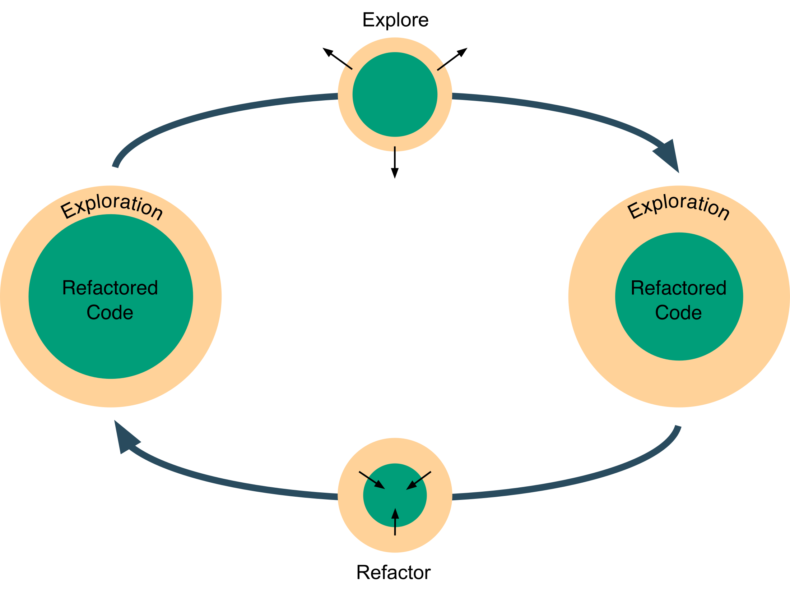

# Production Data Science

<!--Why-->

Data scientists, like software developers, implement tools using computer code. However, unlike software developers, data scientists do not typically receive a proper training on good practices and effective tools to collaborate and build products.

<!--What-->

This guide attempts to merge the gap that data scientists may have in software development practices. We will look at a data science workflow in Python that adapts ideas from software development that ease collaborations and keeps the project in a state that is easy to productionise.

<!--How-->

At the core of the data science workflow presented in this guide is an adaptation of the feature development and refactoring cycle which is typical of software development. In the software development cycle, new features are added to the code base and the code base is refactored to be simpler, more intuitive and more stable. In data science, data exploration takes the role of feature development. With this analogy, the data science cycle loops through data exploration and refactoring.

  

  

In the exploratory phase, the code base is expanded through data analysis, feature engineering and modelling. In the refactoring phase, the most useful results and tools from the exploratory phase are translated into modules and packages.

An important motivation behind the workflow presented in this guide is to _make life easier for other people and your future-self_. The reason behind this motivation is that the combined time that other people save when understanding your tidier work is much more than the time you spend to tidy up your work. So, if everyone works with other people in mind, everyone eventually saves time. Moreover, as time goes on, you may forget the details about what you are working on now. So, it is also in your best interest to tidy up your work to make life easier for your future-self.

We will present the data science workflow using a tutorial, based on the popular [Kaggle's Titanic data science challenge](https://www.kaggle.com/c/titanic) and formed of four parts: [*A - Setup*](tutorial/a-setup), [*B - Explore*](tutorial/b-explore), [*C - Refactor*](tutorial/c-refactor) and [*D - Iterate to Product*](tutorial/d-iterate_to_product).

This tutorial assumes that you are familiar with Python 3, and relies on the assumption that you are skilled enough to use Google, StackExchange and other resources to fill some of the knowledge gaps that you may have. Another useful resource to get you started on new topics in Python is [The Hitchhiker’s Guide to Python](http://docs.python-guide.org/), which also includes references to more detailed material.

The links in this tutorial should be used only when the symbol [**➠**](#) appears. All other links point to further resources and are optional.

> Quoted text is devoted to suggestions and observations.

Finally, here is a five-minute read about the [story and motivation of the data science worflow](http://datadrivenjournalism.net/resources/production_data_science).

Let's start the tutorial!

[**➠   Start the Tutorial**](tutorial/a-setup)

