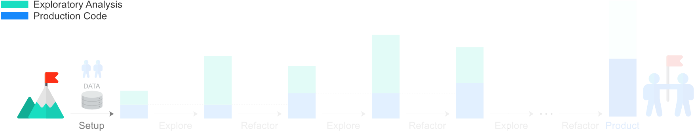

# A - Setup



In the first part of the tutorial, we set up the project, so that we start with an effective working environment.

> Note to Windows users: The commands in tutorial work on the Unix Bash command line. In order to get them to work on Windows, you can use [Cygwin](https://www.cygwin.com/) or related applications.

## Virtual Environment

Python has a useful feature, called [virtual environment](https://docs.python.org/3/tutorial/venv.html), which allows to hold a collection of packages in an isolated Python environment. Since we want to keep the Python packages associated to this project separate from those associated to other projects, we create a virtual environment.  After making sure that Python 3 is installed in the system, we use [`virtualenvwrapper`](https://virtualenvwrapper.readthedocs.io/en/latest/install.html) to initialise a virtual environment called `titanic_datascience`.

```shell
mkvirtualenv --python=python3 titanic_datascience
```

The environment should be activated by default after creation. However, if it is not active, you can activate it with the command `workon titanic_datascience`. We can use the command `which python` to get the path of the Python executable to verify that we are in the correct environment.

## Project Structure

We start by creating a [minimal structure for a Python package](http://python-packaging.readthedocs.io/en/latest/minimal.html), which will be at the core of automation and productionisation. Go into the folder where you would like to store the project, which you may call `titanic_datascience` for coherency with the name of the virtual environment, and create the following structure of folders 📁 and files 📄.

```
📁 titanic/
    📄 __init__.py
📄 README.md
📄 setup.py
```

> If you are unfamiliar with the unix terminal, use `pwd` to check which folder you are currently into, `ls` to list folders and files in the current folder, `cd path-to-folder` to move folder, `mkdir folder-name` to create a new folder and `touch file-name` to create a new file.

Here is a description of the structure above:

- The folder called [`titanic/`](titanic) is dedicated to the Python package for production.

- [`titanic/__init__.py`](titanic/__init__.py) is an empty file to [initialise](https://docs.python.org/3/tutorial/modules.html#packages) the titanic package.

  > Note that `__init__.py` files do not have to be empty and can be used, for example, to initialise code for the package.

- [**➠**  `setup.py`](setup.py) is the [setup script](https://docs.python.org/3/distutils/setupscript.html) that is run when installing the module. You may want to change the `author` and `author_email` fields in [`setup.py`](setup.py) to match your details.

- The Markdown file [`README.md`](README.md) should contain a description of the package. Moreover, the `readme()` function in [`setup.py`](setup.py) adds the content of [`README.md`](README.md) to the `long_description` parameter of the package in `setup()`, and requires the package [`pypandoc`](https://pypi.python.org/pypi/pypandoc) to be installed.

  ```shell
  pip install pypandoc==1.4
  ```
  > Note that when installing packages with `pip`, we specify the package version in order to make sure that we can run the code without issues. When you will create your own setup for different projects, it is better to use updated packages by omitting the version number.
  > ```shell
  > pip install pypandoc
  > ```

  Since files called [`README.md`](README.md) are automatically displayed by GitHub as webpage descriptions, [`README.md`](README.md) has been used for the content that you are reading in this moment. In your case, instead, you may start this file with,

  ```markdown
  # Analysis of the Titanic dataset

  This projects aims at analysing Kaggle's Titanic dataset and build a predictive model for the Titanic data science challenge.
  ```

  and add information as the project progresses.

Having created the above files, we can install the local [`titanic/`](titanic) package in [development mode](https://pip.pypa.io/en/stable/reference/pip_install/#editable-installs),

```shell
pip install -e .
```

The option `-e`, standing for `--editable`, installs the package in [development mode](https://pip.pypa.io/en/stable/reference/pip_install/#editable-installs), that is, [using a symlink](http://python-packaging.readthedocs.io/en/latest/minimal.html#creating-the-scaffolding) to the local [`titanic/`](titanic) folder so that we can develop the package while it is installed. We use `.` to indicate the folder where [`setup.py`](setup.py) is.

In addition to the Python package structure just created for automation and productionisation, we need a folder that will contain exploratory analyses and a folder to store data to be used only for exploration. For these, we create the folders [`exploration/`](exploration) and [`exploration/data/`](exploration/data), which should be left outside of the  [`titanic/`](titanic) package, as the package should only contain elements aimed at production. For the data, download `train.csv` from the [**➠ Titanic data science competition page**](https://www.kaggle.com/c/titanic/data), rename it to  `titanic.csv` and store it in [`exploration/data/`](exploration/data).

> Note that in this case the data, being small, is store directly in our project folder. If the data is big or confidential, it should be stored in different places, for example in a secure cloud location.

> It is good to create `README.md`  files in the [`exploration/`](exploration) and [`exploration/data/`](exploration/data) folders when something about the data and exploration should be told, like good practices and conventions. For example, it may be useful to store data in zip archives to save some space, and this should be written in the `README.md` in the data folder so that other people will be consistent with the choice.

Putting all together, we get the following project structure.

```
📁 exploration/
    📁 data/
        📄 titanic.csv
📁 titanic/
    📄 __init__.py
📄 README.md
📄 setup.py
```

> Although for data science this is a general base structure, some projects may require different ones. To understand what is a suitable base structure for a project, it may be helpful to think about the data as the start point and the project goal as the end point, and see how exploration can bridge the gap. In our case, the start point is the Titanic data and the end point is predicting the passenger survival.
>
> Asking questions about how to bridge the start and end points may help clarify what is needed for the project. This does not mean trying to predict the details of the projects ahead of time, as this would lead to a strict template that prevents flexibility. Instead, this exercise should help understand what is necessary.

The project structure that we have created can be explored at the [top of this page](#).

Now that the project has been set up, we proceed to the next part of the tutorial where we will see how multiple people can collaborate on the project.

[**➠   Go to the next part: *B - Collaborate***](../b-collaborate)
