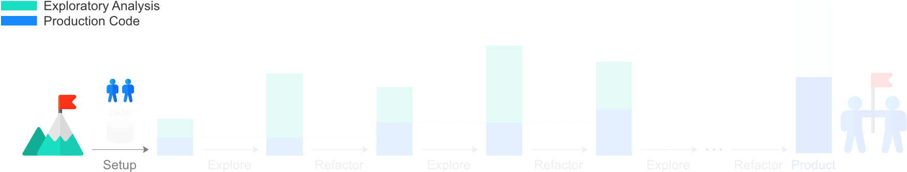

# B - Collaborate



In the second part of this tutorial, we explain how multiple people can collaborate on the project.

> _**Note** that all the commands in this tutorial are run from the root folder of the project_.

## Reproducibility

In order for other people to be able to reproduce the same environment that we are using, we create the file [`requirements.txt`](requirements.txt) containing the [list of packages in our virtual enviroment](https://pip.pypa.io/en/stable/reference/pip_freeze/).

```shell
pip freeze | grep -v titanic > requirements.txt
```

The `grep -v titanic` command omits the local package [`titanic`](titanic) to avoid errors when installing packages from the requirement file, as we will see in section [Reproducing Environment](#reproducing-environment).

We also add the package we installed in part [A - Setup](../a-setup), `pypandoc`, as [minimal package requirements](https://packaging.python.org/discussions/install-requires-vs-requirements/) to [`setup.py`](setup.py).

```python
...
setup(
	...
    install_requires=[
      	'pypandoc>=1.4'
    ]
)
```

We will use these additions to reproduce the working environment in section [Reproducing Environment](#reproducing-environment). Before that, we need to share our project.

## Sharing

To allow other people access to the work, we share it on [GitHub](https://github.com/), using the [Git](https://git-scm.com/) command line tools.

Since we want to add to this repository only the necessary files, we create a [list of files to omit](https://git-scm.com/docs/gitignore) by storing it in a [`.gitignore`](.gitignore) file. The files to omit, are, for example, files that are created in the project folder when we installed the [`titanic`](titanic) package. A list of such files for Python has [already been compiled by other people](https://raw.githubusercontent.com/github/gitignore/master/Python.gitignore), so that we can simply copy it in our project folder.

```shell
curl -o .gitignore https://raw.githubusercontent.com/github/gitignore/master/Python.gitignore
```

Note that operating system specific files should be [omitted at global level](https://help.github.com/articles/ignoring-files/#create-a-global-gitignore) using the command below, matching your operating system.
```shell
# Unix
curl -o $HOME/.gitignore_global https://raw.githubusercontent.com/github/gitignore/master/Global/Linux.gitignore

# Mac
curl -o $HOME/.gitignore_global https://raw.githubusercontent.com/github/gitignore/master/Global/macOS.gitignore

# Windows
curl -o $HOME/.gitignore_global https://raw.githubusercontent.com/github/gitignore/master/Global/Windows.gitignore
```

Next, we set up a new repository; call it `titanic_datascience`, and push the content we created into it by following the official GitHub guide:

[**➠   Creating a new GitHub repository**](https://help.github.com/articles/adding-an-existing-project-to-github-using-the-command-line/)

> It is important to learn Git well, otherwise it can be easy to mess up a repository. You may start with [this tutorial](https://try.github.io) and later take a proper course, as, for example, the free course [How to Use Version Control in Git & GitHub](https://www.udacity.com/course/how-to-use-git-and-github--ud775)

After these additions, the project structure, found at the [top of the page](#), becomes the following.

```
📁 exploration/
    📁 data/
        📄 titanic.csv
📁 titanic/
    📄 __init__.py
📄 .gitignore
📄 README.md
📄 requirements.txt
📄 setup.py
```
## Reproducing Environment

If other people would like to contribute to the project, they just need to get the repository and reproduce the working environment.

```shell
git clone <git-repository-url>                     # Download the repository from GitHub
cd titanic_datascience
mkvirtualenv --python=python3 titanic_datascience  # Create empty virtual environment
pip install -r requirements.txt                    # Install packages listed in requirements.txt
pip install -e .                                   # Install the titanic package in development mode
```

## Contributing

There are two ways in which we can contribute to a data science project aimed at production; we can explore the data through a data science analysis or refactor analyses into production.

In part [A - Setup](../a-setup), we separated the exploratory analysis and the production code using folder [`exploration`](exploration) to store analyses, and Python package [`titanic`](titanic) to store the production code. To complete the separation of concerns of exploration and productionisation, we introduce a Git workflow exemplified in the following diagram.


In this workflow, we dedicate the *Product* branch (blue) to production code, the *Explore* branch (green) to exploratory analyses and the *Refactor* branch (orange) to refactoring exploratory analyses into production.

Let us walk through the example diagram, starting from the left. Explore branch `A` is created from the Product branch. Exploratory work is carried out and committed; commits are denoted by coloured circles. Once the exploratory work in branch `A` is over, the branch is merged into the Product branch. Refactor branch `a` is created, used to refactor the exploratory work carried out in branch `A`, and merged into the Product branch. At the same time, Explore branch `B` is created to carry out a new analysis, which is later refactored in Refactor branch `b`. While work is carried out in branch `B`, another Explore branch, `C`, is created, and so on.

For the Product branch we use the `master` branch, from which we branch out Explore and Refactor branches. We will differentiate the Explore branches from Refactor branches by using names starting with "explore", in the format `explore_<name>`.

A Refactor branch can effectively be viewed as a feature branch, in the [Feature Branch workflow](https://www.atlassian.com/git/tutorials/comparing-workflows/feature-branch-workflow) for software development, where new features come from insights and code from exploratory analyses. *In this view, we can think of adding branches for exploratory analyses, with dedicated folders, to the Feature Branch workflow.* In the same way, it is possible to extend other Git workflows, such as the [Gitflow](https://www.atlassian.com/git/tutorials/comparing-workflows/gitflow-workflow) and [Forking](https://www.atlassian.com/git/tutorials/comparing-workflows/forking-workflow) workflows, by introducting branches dedicated to exploration. As a consequece, when using these workflows extended for exploration, software developers feel at home.

Now that we have a strategy to collaborate, we proceed to the next part of the tutorial, where we will do some exploratory data analysis.

[**➠   Go to the next part: *C - Explore***](../c-explore)