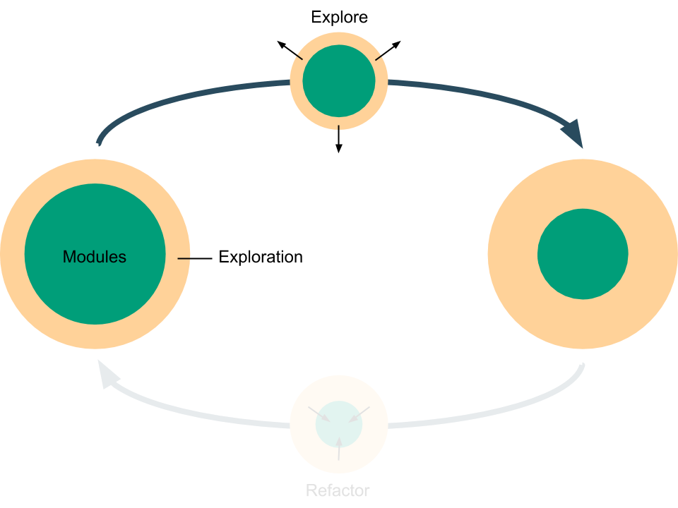

# B - Explore



In the second part of this tutorial, we explore the Titanic data and build a model to predict if a passenger will survive.

> Before starting the tutorial, remember to re-activate the Python virtual environment, if it is not already active.
> ```shell
> workon titanic
> ```

## Branching

In software development, [branching](https://git-scm.com/book/en/v2/Git-Branching-Basic-Branching-and-Merging) is used to isolate the development of new features so that people do not interfere with each other when working on different features. Branching can be easily extended to data science, where instead of developing new features, we explore different aspects of the data.

We start by creating a new branch called `predict_passenger_survival`.

```shell
git checkout -b predict_passenger_survival
```

> It is important to use explicit names for branching, so that other people can easily understand the purpose of the branch.

## Tools

There are [several softwares for exploratory data analysis in Python](https://www.datacamp.com/community/tutorials/data-science-python-ide). Some of the most widely used are,

- [Jupyter Notebook](http://jupyter.org/)
- [Spyder](https://github.com/spyder-ide/spyder) or other IDEs specific to data science
- Normal text editors

Even though choosing a single software for exploratory data analysis across different people would be more consistent, it may be better to explore by using your favourite one, so that you can be more effective in your analyses. The important thing is to make sure that the exploratory work is reproducible and clearly explained to make life easier to other people.

> **In collaborative work, make life easier to other people by following good coding practices and by explaining concepts, intentions and assumptions clearly.**
>
> In particular, it is strongly suggested to read these [PEP](https://www.python.org/dev/peps/) (Python Enhancement Proposals) guides:
>
> - [The Zen of Python](https://www.python.org/dev/peps/pep-0020/)
> - [Style Guide for Python Code, commonly known as PEP 8](https://www.python.org/dev/peps/pep-0008/)
>
> Moreover, have a look at [The Best of the Best Practices (BOBP) Guide for Python](https://gist.github.com/sloria/7001839).

## Exploratory Data Analysis

In this tutorial, as exploratory tool we choose the Jupyter Notebook as it is a self-contained document and it can be displayed on GitHub.

```shell
pip install jupyter
python -m ipykernel install --user --name=titanic  # Install the Jupyter kernel
```

We also need some other data science packages.

```shell
pip install watermark==1.5.0 pandas==0.20.3 scikit-learn==0.19.0 scipy==0.19.1 matplotlib==2.1.0
pip freeze | grep -v titanic > requirements.txt
```

Now, click on the following link to go to the notebook.

[**➠   Go to the analysis in the Jupyter Notebook**](exploration/predict_survival_using_logistic_regression_with_sex_age_title/analysis.ipynb)

Finally, we commit our changes to the branch and push them to GitHub.

```shell
git add .
git commit -m "Predict passenger survival using ridge logistic regression"
git push
```

> Generally, branch names should state the purpose of the branch as they look at the future, while commit messages should state what has been done, as they look at the past.
>
> Moreover, it is effective to follow writing style practices and start both branch and commit messages with _[action verbs](https://books.google.co.uk/books?id=Fp4-7EWkvUgC&lpg=PP1&dq=joshua%20schimel%20writing%20science&pg=PP1#v=onepage&q=joshua%20schimel%20writing%20science&f=false) in [active voice](https://en.wikipedia.org/wiki/The_Elements_of_Style#Content) and [present tense](https://git-scm.com/book/en/v2/Distributed-Git-Contributing-to-a-Project)_, as they are much more direct that nouns.

## Organisation of the Exploration Folder

The exploratory folder is the place where to store exploratory analyses.

To make it easy for other people and your future-self to navigate exploratory analyses we suggest the following rules:

- **Single Result** — Each exploratory project should prove a single result.
- **Dedicated Folder** — Each exploratory project should be placed in a dedicated folder. Even if you start with a single file, use a dedicated folder as more files are likely to be created later on. Moreover, in this way the structure of the exploratory folder is consistent.
- **Meaningful Name** — Give the exploratory project a name that shows what is done inside, like `predict_survival_using_logistic_regression_with_sex_age_title` for the one just seen.
- **Exploration = Document** — Treat the exploratory project as a document to explain the logic of the analysis. In a Jupyter Notebook this can be done using the Markdown feature. With other tools, it may be useful to write the explanation in code comments and in a `README.md` file, which will also be displayed automatically by GitHub.
- **Author Contact** — Write the author name(s), GitHub account(s) and, if necessary, email(s). This ensures that if the content of a notebook is not clear, it is easy to reach someone who can clarify.
- **Achievement** — State the (single) achievement at the beginning of the notebook or readme file. This allows people to know the result, without having to go through the whole notebook.
- **Introduction** — Guide the reader with an introduction to the notebook, like the introduction to a chapter of a book. If you can, write the introduction in the form of a story.
- **Clear Code** — Making sure that the code is clear by following good coding practices. Exploratory work is not an excuse for bad code. As long as it is work that has to be shared with other people or to be reviewed in the future, make it easy for the reader.

As an example, if this project were to expand, the structure of the folder `exploration` may look like this:

```
📁 exploration/
    📁 predict_survival_using_logistic_regression_with_sex_age_title/    # Jupyter Notebook
        📄 analysis.ipynb
    📁 relation_between_age_and_survival/                                # Spyder (IDE)
        📁 .spyproject/
            📄 <spyder_stuff>
        📄 analysis.py
        📄 README.md
    📁 logistic_regression_vs_svm/                                       # Normal text editor
        📄 analysis.py
        📁 plots/
        📄 README.md
```

In this part of the tutorial we saw a simple data analysis using the Jupyter Notebook and suggested some rules to ease collaborations and develop clear exploratory analyses. In the next part of the tutorial we will refactor the analysis of this part into the [Titanic package](titanic) that we prepared in the [previous section](../a-setup).

[**➠   Go to the next part: *C - Refactor***](../c-refactor)

