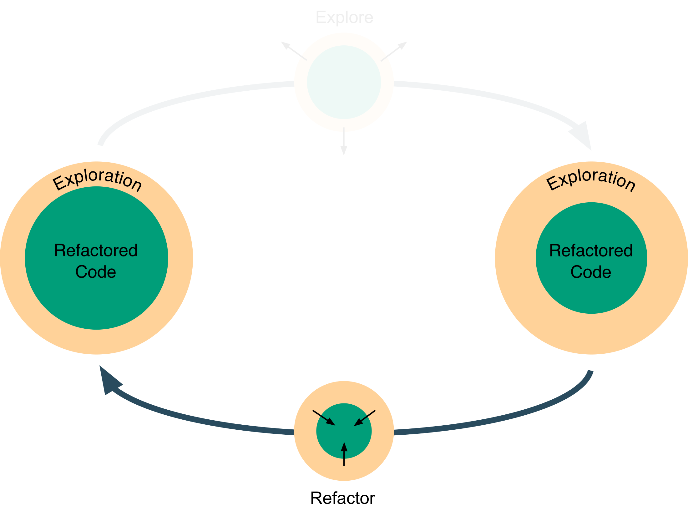

# C - Refactor



In the third part of this worked example, we refactor the code of the exploration in the Jupyter Notebook into the Titanic package that we initialised in part [A - Setup](../a-setup).

## Refactoring for Exploration

The code in the Jupyter Notebook that we saw in the previous part of this tutorial is written as a script. The idea of refactoring for exploration is to **restructure code _and_ text so that analyses are easier to understand and further exploration becomes faster to do**. For this, it is useful to introduce the concept of _code to text ratio_.

Since the main purpose of an exploratory analysis is to prove a point rather than showing code, refactoring for exploration should be aimed at _reducing the code to text ratio, within reason_. In this way, a notebook would look more like a document that uses words (and plots) to reason and prove a point.

However, with this criterion, we may as well increase the number of words, just to decrease the code to text ratio. This leads to longer documents that are both text and code heavy and, in turn, harder to read. A better solution is to **simplify both code and text, while keeping the code to word ratio reasonably low**.

> I had the idea of code to text ratio from the data-ink ratio introduced by Edward Tufte in [*The Visual Display of Quantitative Information*](https://www.edwardtufte.com/tufte/books_vdqi) as a quantity to maximise to convey information through graphics in a more effective way.
>
> Related to code to text ratio is Donald Knuth's paradigm of [literate programming](https://en.wikipedia.org/wiki/Literate_programming) that encourages people to write for people, rather than computers.

Note that if an analysis does not lead to any useful result or did not develop useful tools, _it may as well be useless to refactor it_.

Following the principle above, a possible workflow for refactoring notebooks is the following.

1. Repeated scripts can be moved into functions that are called multiple times, reducing the amount of code in the notebook and, therefore, improving readability.
2. Functions that become widely used in the analysis, can be moved into [Python modules](https://docs.python.org/3/tutorial/modules.html) located in the same directory of the exploratory analysis. This further reduces the code in the notebook and allows the functions to be called from other notebooks or scripts in the same folder of the analysis.
3. Functions that become particularly important, can be made more solid by writing unit tests, as explained in the section below.

The same workflow is easily adapted to IDEs and text editors.

## Refactoring for Production

Once an exploratory analysis has taken a certain direction, it is useful to refactor the parts of the code that are going into production, as, for example, the functions and methods that will form data pipelines.

[Refactoring for production](https://en.wikipedia.org/wiki/Code_refactoring) is a field covering many areas, such as readability, code complexity, code architecture and testing. To make the tutorial easy to follow, the code was already made readable and the Titanic toy-example problem kept the complexity and architecture simple. So, in this section we will focus just on testing.

Since refactoring data science for production is closer to software development than refactoring for exploration, we can rely more on standard testing methodologies. Moreover, data science broadly involves data preprocessing and predictive modelling, for which testing is done differently.

In data processing, the general idea to [write tests](https://pandas.pydata.org/pandas-docs/stable/contributing.html#test-driven-development-code-writing) is to,

1. Create an input dataset with peculiar cases
2. Create the output dataset that we expect from processing the input dataset
3. Compare the processed input dataset and expected output dataset


In predictive modelling, the situation is similar if we take the model predictions as output and, if random processes are involved, we fix the random seed. However, if we would like to improve the model along the way, we must allow for the output to change, meaning that, instead of testing the exact output, we *test properties* of the output. This kind of testing is analogous to the [validation testing](https://en.wikipedia.org/wiki/Software_verification_and_validation) in software development, where tests check that systems meet some requirements. In our example, we may require that the logistic regression model performs _at least_ as well as the majority vote classifier. Note that to run this validation test we need to store some data. For this example, we choose the entire dataset, as it is small. For large datasets, you can store a smaller sample to use just for validation. Moreover, because this validation data is used only for tests, we store it in a folder called [`validation_data`](tests/validation_data) in the [`tests/`](tests/) folder. 

 If more extensive validation tools are required, there are some useful testing tools for Python:

- [Hypothesis](https://hypothesis.readthedocs.io) — A package to create unit tests which are simpler to write and more powerful when run, finding edge cases in your code you wouldn’t have thought to look for
- [Engarde](http://engarde.readthedocs.io/) — A package for defensive data analysis
- [TDDA](http://tdda.readthedocs.io/en/latest/) — A package for test-driven data analysis
- [Faker](https://faker.readthedocs.io) — A package to generate fake data
- [Feature Forge](https://feature-forge.readthedocs.io) — A package that provides some help with the boilerplate of defining features and help you testing them

## Refactoring the Notebook

In this section, we refactor some of the [notebook](exploration/cleaning_engineering_logistic_regression.ipynb) code into the [`titanic`](titanic) package for production. We do this by creating the modules [`titanic/data.py`](titanic/data.py) and [`titanic/models.py`](titanic/models.py) where we put respectively functions for data processing and predictive modelling. We use this modular approach motivated by the [Single Responsibility Principle](https://en.wikipedia.org/wiki/Single_responsibility_principle), which states that each bit of code should be focused on a single task with a limited scope. Some reasons behind this principle are that modular files are easier to maintain, discourage the use of global variables, and encourage the use of  variables with narrow scopes and input and output parameters.

We will also use the [NumPy docstring format](https://github.com/numpy/numpy/blob/master/doc/HOWTO_DOCUMENT.rst.txt), as it is more readable that the standard [Python reStructuredText format](https://www.python.org/dev/peps/pep-0287/).

> When refactoring, keep in mind that [**code is read much more often than it is written**](https://www.python.org/dev/peps/pep-0008/#a-foolish-consistency-is-the-hobgoblin-of-little-minds).
>
> In particular, these four actions help a lot:
>
> - Use explicit variable names
> - Write docstrings
> - Comment your code
> - Commenting too much may mean that you should improve your code instead

To see the refactoring, click on the following links.

- [**➠   Refactored Jupyter Notebook**](exploration/predict_survival_using_logistic_regression_with_sex_age_title/analysis.ipynb) (See orange text for refactoring.)
- [**➠   Data manipulation module: *data.py***](titanic/data.py)
- [**➠   Predictive models module: *models.py***](titanic/models.py)

## Unit Tests

For these functions, we also create unit tests in [`tests/`](tests/) by using [PyTest](https://docs.pytest.org), as this library is more user-friendly than the standard [unittest](https://docs.python.org/3/library/unittest.html) library.

```shell
mkdir tests/
pip install pytest==3.2.3 pytest-runner==2.12.1
```

Add the following content to [`setup.py`](setup.py):

```python
...
setup(
	...
    install_requires=[
		...
        'pytest>=3.2.3',
        'pytest-runner>=2.12.1',
    ],
    setup_requires=['pytest-runner'],
    tests_require=['pytest'],
)
```

To tell Python to use PyTest for testing, create the configuration file [`setup.cfg`](setup.cfg) with the following content.

```ini
[aliases]
test=pytest
```

To see the tests for the functions in the [data.py](titanic/data.py) and [models.py](titanic/models.py) modules, click on the following links.

- [**➠   Tests for the data manipulation module: *test_data.py***](tests/test_data.py)
- [**➠   Tests for the predictive modelling module: *test_models.py***](tests/test_models.py)

To run the tests, you can use the following command.

```shell
python -m pytest
```

## Commit and merge

Finally, we commit the changes, merge the `predict_passenger_survival` branch with the `master` branch and push the content to the GitHub repository.

```shell
git add .
git commit -m "Refactor exploratory analysis of passenger survival predictions using ridge logistic regression"
git checkout master 
git merge refactor_explore_survival
git push
```

In this part of the tutorial we saw how to refactor an exploratory analysis into the [`titanic`](titanic) package. In the next part, we will discuss how to iterate exploration and refactoring to obtain a product.

[**➠   Go to the next part: *D - Iterate to Product***](../d-iterate_to_product)