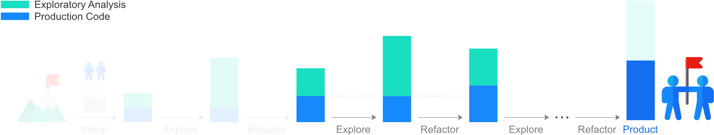

# D - Iterate to Product



In the fourth part of this worked example, we discuss the iteration of the explore-refactor cycle and create a data pipeline that can be run from the command line, corresponding to our end-product.

## Explore-Refactor Cycle

So far, we have seen a single exploration and a single refactoring steps. The idea of the workflow presented in this tutorial is to cycle through small exploration and refactoring steps, instead of doing a single big exploration, refactoring just at the end.

Cycling through small exploration and refactoring steps has several advantages over a single exploration with final refactoring.

- Cycling through refactoring and exploration keeps the code modular. In turn, **the codebase becomes smaller, and easier to reuse and fix**. In general, [viewing code as a liability](https://youtu.be/YyhfK-aBo-Y?t=17m42s), less code means less liability.
- Modular code allows to build tests that make the **codebase robust against change**. In addition, by writing tests, it is easier to exploit the weaknesses of a system.
- By calling functions and methods from the refactored modular code, analyses contain less code. By containing less code, **analyses focus more on proving a point** through argumentations, which is what an analysis is supposed to do. In addition, basing an analysis on a modular codebase, prevents the dangerous tendency of copying and pasting code snippets from older analyses.
- By taking advantage of the modular codebase, **it is faster to carry out new analyses**. For example, we may use just a few lines of code to call functions or methods from the codebase to clean our data or make customised plots. In addition, using refactored and tested code **reduces the risk of reaching a wrong conclusion in an analysis**.
- Modular code is faster and easier to simplify and document. Simple and documented code, together with focussed analyses, lead to a work that is easier to read, understand and change, therefore, **boosting collaboration**.


- By following the refactor-explore cycle, **the code is kept in a state that is quick to productionise**.

## Data Pipeline

To complete our product, we implement the work into a pipeline and create a command line tool to launch the pipeline from the terminal.

First, we create a new Git branch, called `data_pipeline`.

```shell
git checkout -b data_pipeline
```

Then, we write the code of the pipeline into the module `pipelines.py` inside the [Titanic package](titanic).

[**➠   Go to the data pipeline module: *pipelines.py***](titanic/pipelines.py)

To implement the command line tool to run the pipeline, we use the [Click](http://click.pocoo.org/) library instead of the standard [argparse](https://docs.python.org/3/library/argparse.html), as Click is more [user-friendly](http://click.pocoo.org/5/why/).

```shell
pip install click==6.7
pip freeze | grep -v titanic > requirements.txt
```

We also add the following lines to [`setup.py`](setup.py).

```python
...
setup(
    ...
    install_requires=[
        ...
        'click>=6.7'
    ],
	...
    entry_points='''
        [console_scripts]
        titanic_analysis=titanic.command_line:titanic_analysis
    '''
)
```

The command line tool is implemented in the following file,

[**➠   Go to the command line module: *command_line.py***](titanic/command_line.py)

and is run from the terminal using the following command — Note that the virtual environment `titanic` has to be active to run this command.

```shell
titanic_analysis --filename exploration/data/titanic.csv
```

Finally, we commit the changes and push the content to the GitHub repository.

```shell
git add .
git commit -m "Add data pipeline and command line tool to launch it"
git checkout master 
git merge data_pipeline
git push
```

## Distributing the Product

Once a product is ready, most people just use the Python package without contributing to it. In this case, the package can be conveniently installed in a single line of code.

```shell
pip install -e 'git+https://github.com/<github_account>/titanic_datascience.git#egg=titanic'
```

> For a private repository accessible only through an SSH authentication, substitute `git+https://github.com` with `git+ssh://git@github.com`.

This commands installs only the package `titanic`, as specified in `setup.py`, and omits other files, like the [`exploration/`](exploration) folder or [`requirements.txt`](requirements.txt).

In this part of the tutorial we saw how to iterate the explore-refactor cycle, how to create a data pipeline interface accessible through the command line, and how to distribute the product.

Congratulations for completing the tutorial! :tada:

To set up your next project, you can use the Cookiecutter template at the following link.

[**➠   Go to the Project Template**](../../template)